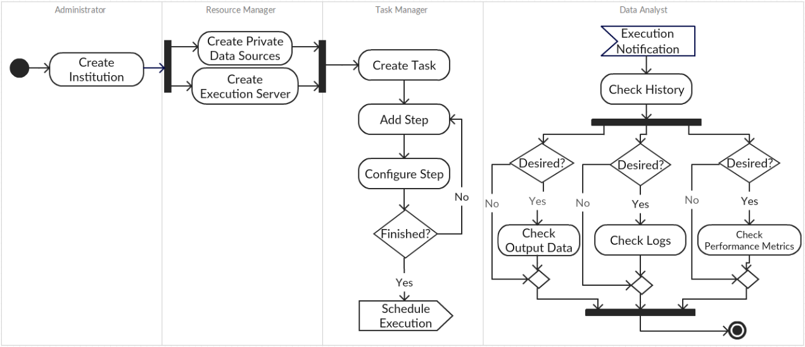
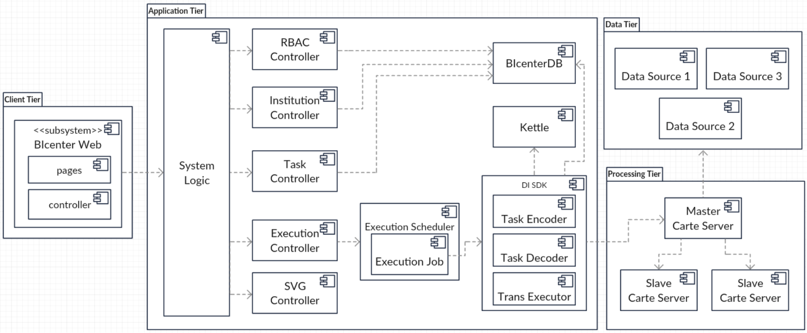
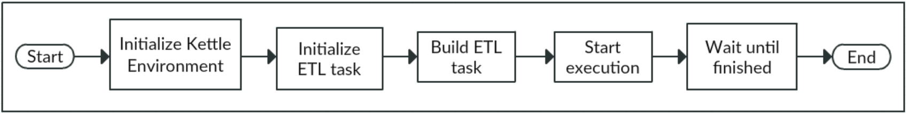

# System Implementation

This chapter contains the description of the main aspects of BIcenter implementation.

## Requirements

The main goal of this application was to allow the building and management of ETL pipelines, by non-IT users, in a multi-institution environment. Therefore, some functional requirements were were considered to implement a proper and reliable solution.

Each institution manages and mantains ETL tasks and provides the resources for the execution of the associated tasks. Thus, each institution owns its private data sources, servers for ETL task execution and a task scheduler that allows periodic execution. In order to provide access and management control of ETL tasks and institutions, there are four distinct types of users: 1) Administrator, entity that moderates the platform, and it has permissions to create and delete institutions; 2) Resource Manager, entity that manages private data sources and execution servers, and it has permissions to create and delete private data sources and execution servers, within specific institutions; 3) Task Manager, entity that builds and executes ETL tasks, and it can create and configure ETL tasks, within specific institutions; and 4) Data Analyst, actor with permissions to inspect task execution history, namely the resulting data, execution logs and performance metrics.

The functional model was derived from the identification of all key components from a top-down analysis of the system requirements. Figure \@ref(fig:workflow)  illustrates step by step all actions and interactions between the main actors in order to build and execute ETL tasks and to analyze the output results. Firstly, the administrator must create an institution. A resource manager with access to the institution can create and configure all desired private data sources and task execution servers. Thereafter, a task manager can build and configure the ETL task and then schedule it for periodic or non-periodic execution. At the configured times the task will be sent to the execution server and executed. At the end of the execution, a notification will be sent to the data analysts, so they can check the execution results.

## Architecture

The architecture considers four different tiers: 1) Application tier controls all application functionalities and maintains the system business logic; 2) Data tier is responsible for the maintenance of the private data sources; 3) Processing tier has the duty of executing and monitoring ETL task executions; and 4) Client tier is responsible for the solution presentation and page rendering. Figure \@ref(fig:architecture) illustrates this architecture.

The system logic is built upon five different controllers: 1) RBAC controller provides user identity and evaluates access requests to resources; 2) Institution controller allows the creation and destruction of institutions, and resource allocation in institutions; 4) Task controller enables the creation, configuration and destruction of ETL tasks; and 5) Execution controller uses Kettle and Carte servers, so it can build, remotely execute and monitor ETL tasks.

Data Integration (DI) Software Development Kit (SDK) seeks to bridge the gap between Kettle and the stored information in BIcenter database (DB). It provides methods to build Pentaho’s ETL processes according to the stored information, and also to execute them. Nevertheless, task execution is a periodic process. Therefore, Execution Scheduler manages the task execution scheduling. When the appropriated time arrives, a Execution Job is triggered. That job will communicate with DI SDK so that the given task is indeed executed. SVG controller maps between images and components, with the intent to build the visual pipeline.

BIcenter Web client adopted Model-View-Controller (MVC) architectural pattern. This pattern divides the web application in three different components: 

- Model: represents the knowledge and data in an application. It has the responsability to respond to information requests, proceed to information changes according to given instructions requests, and to notify observers in event-driven systems when information changes. Typically, the application data is stored in a database.
- View: it represents the user interface. The View updates the UI upon changes in the Model, by rendering the data into the suitable UI form.
- Controller: it handles events that occurs in the View, such as user interactions, and updates the Model accordingly.

## ETL SDK

The ETL Task Editor was idealized to allow users to build a visual representation of the desired ETL pipeline. This editor must be able to process a similar structure to the ones used by the desktop ETL tools and generate the correspondent visual representation of the ETL task. MxGraph was used to build the ETL pipeline editor, and this Java/JavaScript diagramming library enables the building of interactive graphs. A graph consists in a set of cells. A cell can either be a vertex or an hop. Thus, a graph is formed by a group of vertices connected by edges. The vertices correspond to the ETL steps and the edges correspond to the ETL hops. Hence, in order to exhibit the desired task within the mxEditor, it is necessary to translate the task to the corresponding mxGraph object. GraphDecoder is responsible for creating a mxGraph and defining the appropriated model, according to the given Task. To insert vertices and edges in the graph model, a transaction must be created (beginUpdate and endUpdate). This is required for the model to remain in a consistent state. A default parent is automatically created and represents the first child of the root cell in the model. Subsequent elements must be added to the default parent.

The ETL SDK was built on top of PDI SDK. Kettle contains a rich set of data integration functionality that is exposed in a set of data integration tools. However, we can also use Kettle as a library in our own software and solutions. Pentaho Data Integration can be used as a Java API composed by three main components: 1) Core, that contains the core classes for Kettle; 2) Database, that contains the database-related classes; and 3) Engine, that contains the Kettle’s runtime classes. 

Figure \@ref(fig:kettle) explains step by step how an ETL task is executed. The initialization of the Kettle environment loads all available plugins, initializes the logging environment and set up and reads the system variables. After the environment initialization, the transformation metadata is loaded and a transformation engine object is instantiated. Then, the execution is prepared and the transformation threads are started. Finally, because the whole transformation runs multi- threaded, it waits until all processing is completed. 

In Kettle, an ETL process can be represented by six classes [31]:

- TransMeta: is the class that defines the information about the ETL process and offers methods to save and load it from XML, as well as methods to alter an ETL process by adding/removing databases, steps, hops, etc.
- Trans: represents the information and operations associated with the concept of an ETL process. It can loads, instantiates, initializes, runs, and monitors the execution of the ETL process.
- DatabaseMeta: defines the database specific parameters for a certain database type.
- StepMeta: is the class that defines the information about a ETL process’s Step.
- TransHopMeta: defines a link between two steps in an ETL process.
- BaseStep: represents the information and operations associated with the concept of an ETL process Step. It offers initialization, row processing and step clean-up methods.

Initially a TransMeta must be properly configured with all proper DatabaseMetas, StepMetas and TransHopMetas. TransDecoder is responsible to create a TransMeta and define all underlying information, according to the given Task. GenericStep is a class that has a generic algorithm to encode or decode a given Step to or from a Kettle’s StepMeta. In order to provide interface segregation, TransDecoder must use the StepDecoder interface that only provides the GenericStep decoding method.

After having a correctly configured TransMeta, it can be executed with the associated Trans object. TransExecutor is a singleton responsible for the initialization, execution and monitoring of the Trans object. Moreover, it writes and stores the execution logs, step measures and status, and the resulting data in real-time. To accomplish this, listeners are coupled to the Trans and Steps objects in order to obtain the results and metrics throughout the transformation’s execution.