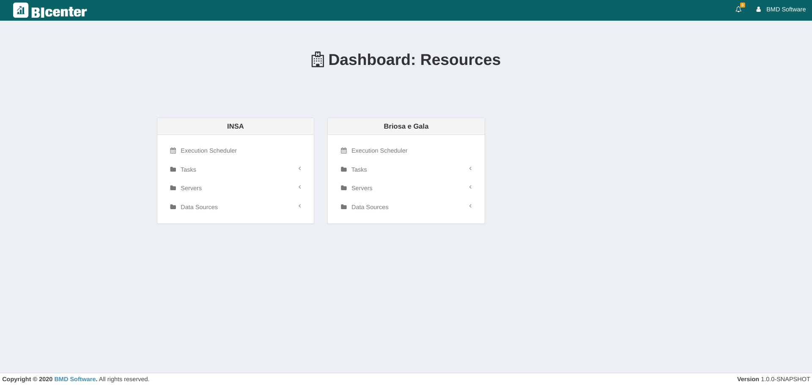

# Guidelines for Developers

In this chapter, it is described the main guidelines for contributing to BIcenter.

## Branching Convention

After some consideration, we decided to implement naming conventions in the branches being created. We followed a scheme similar to the one referred at http://stackoverflow.com/a/6065944

Each branch name is composed of the following:

**category**/_name_

The possible categories are listed below.

| Category | Description |
|----------|--------------------------------------------------------------------------------------|
| bug | Bug fixing |
| imp | Improvement on already existing features |
| new | New features being added |
| wip | Works in progress - Big features that take long to implement and will probably hang there |
| junk| Throwaway branch created to experimentation|

The name should be concise, and directly represent what the branch solves.

Some examples:

bug/issue234

bug/fixeditdb

new/statistics

junk/tryingboostrap3


## Adding an REST API endpoint

1. Create the endpoint at `app` > `controllers`, either on one of the existent JAVA files or a new one if it handles a completely different topic/task, yet to be addressed.

2. Add the respective endpoint URL to:
    * `conf` > `routes`, so that the system knows that endpoint exists;
    * `app` > `controllers` > `Application.java` > `javascriptRoutes()`, so you can use this URL dynamically at JavaScript, regarding frontend code.

Since the structure of this project includes both Frontend and Backend, when you create a REST API endpoint, you'll probably consume it on some frontend feature. Here's how to do that:

1. At `app` > `javascripts` > `services`, there is a collection of JS files that have all the encapsulated logic responsible for communicating with the REST API: one file for each major entity or group of actions. So, in one of these files or a new one, add the function that handles the communication you need with the REST API through your newly developed endpoint.

2. At the JS controller level of your functionality, you call the function specified in the previous step with the necessary arguments and information.

### Example
This example assumes that there isn't an endpoint capable of providing information about all the existent institutions. So the purpose is to create such endpoint and provide a function that allows us to consume it on the frontend. Hence, there are 2 phases: the **creation of the REST API endpoint** and the **creation of the necessary utility to consume it** on the frontend.

#### Creation of REST API endpoint
Because the endpoint we want to create has the purpose of returning the information about all existent institutions, it should be placed at `app` > `controllers` > `InstitutionController.java`, with some code like this:

```java
@Security.Authenticated(Secured.class)
@CheckPermission(category = Category.INSTITUTION, needs = {Operation.GET})
public Result getInstitutions(){
    String email = session().get("userEmail");
    List<Institution> institutions = institutionRepository.list(email);

    ObjectMapper mapper = new ObjectMapper();
    SimpleModule module = new SimpleModule();
    module.addSerializer(Institution.class, new InstitutionSerializer());
    module.addSerializer(Task.class, new SimpleTaskSerializer());
    module.addSerializer(Server.class, new ServerSerializer());
    module.addSerializer(DataSource.class, new DataSourceSerializer());
    mapper.registerModule(module);
    Json.setObjectMapper(mapper);

    return ok(Json.toJson(institutions));
}
```

After creating the endpoint, we need to make it discoverable (be available to the outside world). To do that, we add its URL to:
1. `conf` > `routes`:

```shell
...
GET          /institution/list                    controllers.InstitutionController.getInstitutions()
...
```

2. `app` > `controllers` > `Application.java` > `javascriptRoutes()`:
```java       
public Result javascriptRoutes() {
    response().setHeader(Http.HeaderNames.CONTENT_TYPE, "text/javascript");
    return ok(JavaScriptReverseRouter.create("jsRoutes",
        ...,

        routes.javascript.InstitutionController.getInstitutions(),

        ...
    ));
}
```

#### Creation of utility function to consume the REST endpoint
This second phase explains how to create the referred utility function so we can more easily consume the developed endpoint. Since it's an institution-related method, we will be adding the following utility function to `app` > `javascripts` > `services` > `institution.js`.
```javascript
Institution.getInstitutions = function (callback) {
    jsRoutes.controllers.InstitutionController.getInstitutions().ajax({
    contentType: 'application/json; charset=utf-8',
        success: function (response) {
            if (callback) {
                callback(response);
            }
        },
        error: function (response) {
            console.error('Error in Institution service', response);
        }
    })
 };
```
This consumes the endpoint and, on success calls the specified callback function; otherwise (on fail) displays an error message on your browser's console.

After this, the final part is to consume this utility function, which can also be called a service. A simple example is to use the service on your javascript file that bears the "backend" responsibility of your UI component/view, in a similar way to the following code:
```javascript
Institution.getInstitutions(function (institutions) {
    // do whatever you need with the returned information
});
```

## Adding web view

If you want to create an entirely new base schema (a view), you first need to add a base template name `<name>.scala.html` to `app` > `views`. You also need to make sure that you have an endpoint on JAVA code that handles your request and returns this web view (the "**backend**" process is similar to create a REST API endpoint).

If you just want to create a new UI stage, based on an already defined view, follow these steps:
1. Create an endpoint (and register it) that returns the base view you want to use.

2. At `app` > `assets` > `javascripts`, create the controller and view associated with your new UI stage (the view JS file handles the stuff UI related and the controller handles the stuff Backend related).
  
3. At `app` > `assets` > `templates`, create a file named `<name>.handlebars` where you'll insert the UI code that will be dynamically added to the main div container of your base web view.
  
4. After all these files are ready, you need to make sure the framework knows the path to everything you created, so you'll need to add the paths to your view and controller javascript files in the file `app` > `assets` > `javacripts` > `main.js`.
  
5. Finally, you'll need to add the RegExp handler that will assemble the resources you need (variables and controllers) at `app` > `assets` > `application` > `application.js`.

### Example
This example is going to be divided into two big parts: the **creation of a new view from scratch** and the **creation of a UI component** (through handlebars).

Let's take as an example the creation of a dashboard page, given the fact that we need to create a new base-view from scratch.

**NOTE:** if you just want to create a new UI component, with handlebars, jump to the second part.

### Creation of a new (base) view
To create a new view to use as a base to new UI stages, you first need to add the HTML template. So, add your view structure to a file named `home.scala.html`, for the sake of this example, at `app` > `views`:
```html
<!DOCTYPE html>

<html>
    <head>
        <meta charset="UTF-8">
    <meta http-equiv="X-UA-Compatible" content="IE=edge">
    <!-- Tell the browser to be responsive to screen width -->
    <meta content="width=device-width, initial-scale=1, maximum-scale=1, user-scalable=no" name="viewport">

    <title>BIcenter</title>

    <!-- Boostrap Select2 -->
    <link rel="stylesheet" media="screen" href="@routes.Assets.versioned("lib/select2/select2.min.css")">

    <!-- Font Awesome -->
    <link rel="stylesheet" media="screen" href="@routes.Assets.versioned("lib/font-awesome/css/font-awesome.min.css")">
    <!-- PNotify -->
    <link rel="stylesheet" media="screen" href="@routes.Assets.versioned("lib/pnotify/pnotify.css")">
    <link rel="stylesheet" media="screen" href="@routes.Assets.versioned("lib/pnotify/pnotify.nonblock.css")">
    <!-- query-builder -->
    <link rel="stylesheet" media="screen" href="@routes.Assets.versioned("lib/jQuery-QueryBuilder/css/query-builder.default.min.css")">

    <link rel="shortcut icon" type="image/png" href="@routes.Assets.versioned("images/favicon.png")">

    <!--DataTable dependencies -->
    <link rel="stylesheet" media="screen" href="@routes.Assets.versioned("lib/datatables/dataTables.bootstrap.min.css")">
    <link rel="stylesheet" media="screen" href="@routes.Assets.versioned("lib/datatables/buttons.dataTables.min.css")">

    <!-- jQuery UI -->
    <link rel="stylesheet" media="screen" href="@routes.Assets.versioned("lib/jquery-ui/jquery-ui.css")">

    <!-- Boostrap DateTime-Picker -->
    <link rel="stylesheet" media="screen" href="@routes.Assets.versioned("lib/bootstrap-datetimepicker/bootstrap-datetimepicker.min.css")">

    <!-- iCheck -->
    <link rel="stylesheet" media="screen" href="@routes.Assets.versioned("lib/iCheck/all.css")">
    <link rel="stylesheet" media="screen" href="@routes.Assets.versioned("lib/iCheck/square/blue.css")">

    <!-- Main CSS: Bootstrap + AdminLTE + Custom css -->
    <link rel="stylesheet" media="screen" href="@routes.Assets.versioned("stylesheets/main.min.css")">
    </head>
    <body style="height:auto;" class="skin-darkblue-light fixed home-page">
        <script type="text/javascript" src="@routes.Assets.versioned("lib/mxgraph2/js/mxClient.js")"></script>
    <script type="text/javascript" src="@routes.Assets.versioned("editor/editor.js")"></script>
    <script type="text/javascript" src="@routes.Assets.versioned("editor/graph.js")"></script>

    <div class="container">
        <div module="HeaderModule">
            @header()
        </div>

        <div module="MainModule">
            <div controller="HomeController"></div>
        </div>

        <div class="navbar-fixed-bottom">
            @footer()
        </div>
        </div>

        <script type="text/javascript" data-main="@routes.Assets.versioned("javascripts/main")" src="@routes.Assets.versioned("lib/requirejs/require.min.js")"></script>
    </body>
</html>
```

After creating the template, you now need to create an endpoint to return this view and register it in the system.

So, to create the endpoint you add a new controller at `app` > `controllers` or add a function to an existent controller. In this example we will create a new controller called `HomeController.java`:
```java
public class HomeController extends Controller {
    @Security.Authenticated(Secured.class)
    public Result index() {
        return ok(views.html.home.render());
    }
}
```

And, then, to register it, add to:
1. `conf` > `routes`:

```shell
...

GET               /home                    controllers.HomeController.index()

...
```

2. `app` > `controllers` > `Application.java` > `javascriptRoutes()`:
```java       
public Result javascriptRoutes() {
    response().setHeader(Http.HeaderNames.CONTENT_TYPE, "text/javascript");
    return ok(JavaScriptReverseRouter.create("jsRoutes",
        ...,

        routes.javascript.HomeController.index(),

        ...
    ));
}
```

### Creation of a UI component (handlebars)
Once the URL for the base view is configured, the next step is to create the functional files that handle frontend and backend of the UI element. So, we will create a folder `home` at `app` > `assets` > `javascripts`. Inside this folder create tho files: `homeController.js` and `homeView.js`.

The `homeController.js` is responsible to handle the backend operations and should follow a structure similar to this:
```javascript
define('HomeController', ['Controller', 'HomeView', 'Router', 'Institution', 'Task', 'Alert', 'jquery', 'jsRoutes', 'jquery-cookie'], function (Controller, HomeView, Router, Institution, Task, Alert, $, jsRoutes) {
    const HomeController = function (module) {
        Controller.call(this, module, new HomeView(this));
    };

    // Inheritance from the superclass
    HomeController.prototype = Object.create(Controller.prototype);
    const _super_ = Controller.prototype;

    HomeController.prototype.initialize = function ($container) {
        _super_.initialize.call(this, $container);

    this.getTasks();
    };

    HomeController.prototype.getTasks = function () {
        const context = this;
    Institution.getInstitutions(function (institutions) {
        context.view.loadInstitutions(institutions);
    });
    };

    return HomeController;
});
```

On the other hand, the `homeView.js`is responsible for frontend interactions and should follow a structure similar to:
```javascript
define('HomeView', ['jquery', 'View'], function ($, View) {
    const HomeView = function (controller) {
        View.call(this, controller, 'home');
    };

    // Inheritance from super class
    HomeView.prototype = Object.create(View.prototype);
    const _super_ = View.prototype;

    HomeView.prototype.initialize = function ($container) {
        _super_.initialize.call(this, $container);
    };

    HomeView.prototype.loadInstitutions = function (institutions) {
        const html = JST['home']({
        institutions: institutions
        });
        this.$container.html(html);
    this._loadViewComponents();
    };

    return HomeView;
});

```

As can be seen in this last code snippet, we "import" a web (HTML) structure from `'home'`. This refers to the file `home.handlebars` that must be placed at `app` > `assets` > `templates`. Hence, we will create this exact file in the specified location with the following content:
```html
<div class="main-div">
    <div class="title">
        <h1><b><i class="fa fa-hospital-o"></i> Dashboard: Resources</b></h1>
    </div>

    <div id="institutions" view-element="institutions" class="row">
        {{#institutions}}
            <div class="institution col-lg-4">
                <div class="panel panel-default">
                    <div class="panel-heading">
                        <h3 class="panel-title"><b>{{name}}</b></h3>
                    </div>
                    <div class="panel-body">
                        <ul class="treeview-menu" data-widget="tree">
                            <!-- Tasks -->
                            <li class="treeview menu">
                                <a name="tasks">
                                    <i class="fa fa-folder"></i> <span>Tasks</span>
                                    <span class="pull-right-container">
                                    <i class="fa fa-angle-left pull-right"></i>
                                </span>
                                </a>
                                <ul class="treeview-menu">
                                    {{#tasks}}
                                        <li>
                                            <a <i class="fa fa-file-text-o"></i>
                                                <span>{{name}}</span>
                                            </a>
                                        </li>
                                    {{/tasks}}
                                    <li>
                                        <form class="sidebar-form">
                                            <div class="input-group">
                                                <input name="taskName" class="form-control" placeholder="Create a new task..."/>
                                                <span class="input-group-btn">
                                                <button type="submit" class="btn btn-flat">
                                                    <i class="fa fa-plus-circle"></i>
                                                </button>
                                        </span>
                                            </div>
                                        </form>
                                    </li>
                                </ul>
                            </li>

                        </ul>
                    </div>
                </div>
            </div>
        {{/institutions}}
    </div>
</div>
```

The next step is to tell the system where the newly-created resources are. So, at `app` > `assets` > `javacripts` > `main.js` add the following:
```javascript
requirejs.config({
    baseUrl: '/assets/javascripts',
    paths: {
        ...,

        // Home
    'HomeController': 'home/controllers/homeController',
    'HomeView': 'home/views/homeView',

        ...
    },
    ...
});

var DEBUG = true;

require(['Application'], function (Application) {
    window.app = new Application();
});
```

Last, but not least, we have to create the RegExp handler, as said earlier, so the system know what controllers and tools to load in the specific UI stage, at `app` > `assets` > `application` > `application.js`:
```javascript
define('Application', ['jquery', 'Router', 'Module', 'jsRoutes', 'Svg', 'Institution', 'adminLTE', 'custom.jquery'], function ($, Router, Module, jsRoutes, Svg, Institution) {
    ...

    Application.prototype.initialize = function () {
        var self = this;

    // Configure router
    Router.config({mode: 'history'});

    // Add routes
    Router
            .add(new RegExp(jsRoutes.controllers.login.Login.index().url.substr(1), 'i'), function () {
            console.log("LOGIN PAGE");
        })
            ...
            .add(new RegExp(jsRoutes.controllers.HomeController.index().url.substr(1), 'i'), function () {
            console.log("homepage");

            self.loadControllers('MainModule', ['HomeController']);
        });
    };

    ...

    return Application;
});
```

With this, we will be able to have a web page similar to this image, based on an entirely new HTML template:

<div class="figure">

<p class="caption">(\#fig:view)New HTML view created using a new UI component following the handlebars pattern.</p>
</div>

## Adding new PDI step

Adding and registering a new **Pentaho Data Integration** Step is a straightforward process which has been streamlined by the design of the BICenter project. A list of all available PDI Steps can be found in this [link](https://wiki.pentaho.com/display/EAI/Pentaho+Data+Integration+Steps).

After selecting the Step to be added, the following is the process required to add said step into the system.

1. Register the new step on the `public > editor > diagrameditor.xml` file.
2. Add a new object to `conf > configuration.json` under the subsection pertaining to the new component's type with the desired component properties.
3. If necessary, add extra functionality to the _submitClick_ method on the `app > assets > javascripts > step > stepController.js` or the _applyChanges_ method on `app > assets > javascripts > services > step.js`.
4. Create a new class on `app > diSdk > step > parser` with the appropriate name.
5. If the component requires pre-processing or extra  logic you can alter the _decodeStep_ method on `app > diSdk > step > AbstractStep.java`

### Example

The following is an example of how to add the CSVFileInput component. For more information about this component's functioning you can check out this [link](https://wiki.pentaho.com/display/EAI/CSV+File+Input).

1. Firstly, we have to add the following line to `public > editor > diagrameditor.xml`
```
<add as="CSV File Input" template="CSVInput" icon="/assets/images/editor/rectangle.gif"/>
```

2. Next we'll have to register the component's properties on the `conf > configuration.json` file. As the CSV File Input step is an Input type component, we'll be registering it under the Input Components. We'll be naming this object the same name we used on the `template` field on the prior step. Note that the `shortName` field should have a name that goes in accordance with the naming specified by the Pentaho Kettle library (in our specific case, this can be seen in this [link](https://javadoc.pentaho.com/kettle/org/pentaho/di/trans/steps/csvinput/CsvInputMeta.html)). Under the `componentProperties` array we can specify the multiple inputs and fields of our component.
```
{
          "name": "CSVInput",
          "description": "CSV File Input",
          "shortName": "csvInput",
          "componentProperties": [
            {
              "name": "Step Name",
              "shortName": "stepName",
              "type": "input"
            },
            {
              "name": "File Name",
              "shortName": "fileName",
              "type": "fileinput"
            },
            {
              "name": "Delimiter",
              "shortName": "delimiter",
              "type": "input"
            },
            {
              "name": "Enclosure",
              "shortName": "enclosure",
              "type": "input"
            },
            {
              "name": "NIO Buffer Size",
              "shortName": "bufferSize",
              "type": "number"
            },
            {
              "name": "File Encoding",
              "shortName": "encoding",
              "type": "select",
              "componentMetadatas": [
                {
                  "value": "UTF-8",
                  "name": "UTF-8"
                },
                {
                  "value": "ANSI",
                  "name": "ANSI"
                }
              ]
            },
            {
              "name": "Lazy Conversion?",
              "shortName": "lazyConversionActive",
              "type": "checkbox"
            }
          ]
        }
}
```

3. As BICenter is already prepared to receive files and all of our CSVInput's parameters, we can skip this step.

4. Now we have to create a new class on the `app > diSdk > step > parser` directory. This can simply be done by copying any of the other classes already present in the folder. Don't worry about the lack of logic in this class, as this serves as a mere extension of the AbstractStep class, which itself contains all logic needed to communicate with the PDI, used in order to allow our component to be detected and processed.

```
package diSdk.step.parser;

import diSdk.step.AbstractStep;
import models.Step;
import org.pentaho.di.trans.step.StepMetaInterface;
import org.w3c.dom.Element;

public class CSVInput extends AbstractStep {
    @Override
    public void decode(StepMetaInterface stepMetaInterface, Step step) throws Exception {

    }

    @Override
    public Element encode(StepMetaInterface stepMetaInterface) throws Exception {
        return null;
    }
}
```

5. As we want our system to automatically detect the CSV's fields automatically without the users having to manually introduce them themselves, we have to add some logic to the _decodeStep_ method on `app > diSdk > step > AbstractStep.java` which will do an initial read of the file in order to extrapolate it's columns' names. This can be done by creating a new method on this class and adding it to the _decodeStep_ method, or by injecting the logic directly into the function.

```
// If dealing with CSVFileInput get the input fields and define them
                        if (shortName.equals("InputFields")) {
                            if (fileName == null) {
                                Optional<StepProperty> fileNameStepProperty = stepProperties.stream()
                                        .filter(stepProperty -> stepProperty.getComponentProperty().getShortName().equalsIgnoreCase("Filename"))
                                        .findFirst();

                                if (!fileNameStepProperty.isPresent())
                                    continue;
                                fileName = fileNameStepProperty.get().getValue();
                            }

                            if (delimiter == null) {
                                Optional<StepProperty> delimiterStepProperty = stepProperties.stream()
                                        .filter(stepProperty -> stepProperty.getComponentProperty().getShortName().equalsIgnoreCase("Delimiter"))
                                        .findFirst();

                                if (!delimiterStepProperty.isPresent())
                                    continue;
                                delimiter = delimiterStepProperty.get().getValue();
                            }

                            try {
                                BufferedReader br = new BufferedReader(new FileReader(fileName));
                                String header = br.readLine();

                                String[] fields = new String[0];
                                if (header != null) {
                                    fields = header.split(delimiter);
                                }

                                TextFileInputField[] value = new TextFileInputField[fields.length];
                                for (int i = 0; i < fields.length; i++) {
                                    String field = fields[i];
                                    value[i] = new TextFileInputField();
                                    value[i].setName(field);
                                    System.out.println(field);
                                }

                                // Invoke the current method with the StepProperty value.
                                invokeMethod(stepMetaInterface, method, value, databases);

                            } catch (FileNotFoundException e) {

                            }
```
